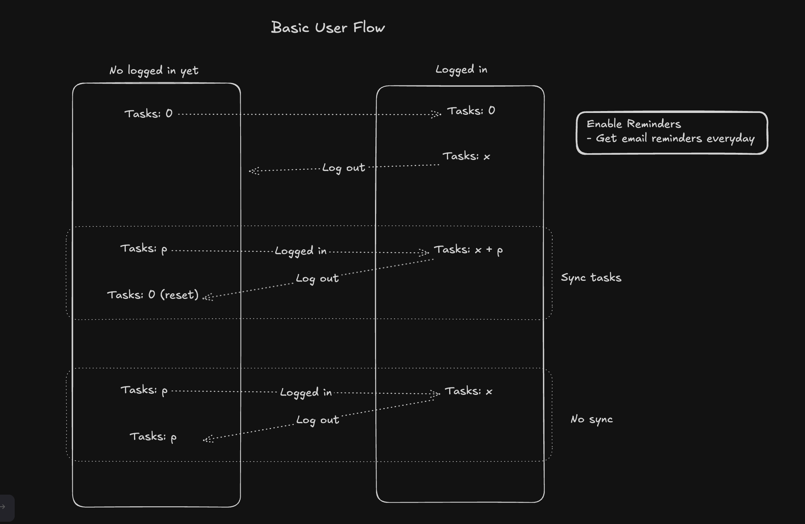

# IdeaVault – Features

## Core Features (Built)

- Add, edit, delete tasks (with title, URL, description, dueDate, priority, status)
- Filters: search, status, priority
- Theming: Dark / Light
- Daily email reminders (9 AM, categorized as Today, Approaching, Overdue)
- LocalStorage vs Supabase task management
  - LocalStorage: tasks are stored locally in the browser
  - Supabase: tasks are stored in the Supabase database
  - Syncing: tasks can be synced between the two. This is useful when you dont want to login in.
- Google Login Provider for authentication
- Settings: enable/disable daily reminders
- Clean UI (Spartan UI + Tailwind)

## Planned

- Bulk operations (delete, update)
- Task groupings & drag/drop
- Animations (Angular 20 APIs, new Animation API)
- Feedback & suggestion box
- Labels / categories with animationns
- Unique & uniform theme (inspiration: [TechBible.ai](http://techbible.ai/) and many more)
- For more examples, [A-Z Portfolios](https://github.com/emmabostian/developer-portfolios)
- AI features (Gemini: suggestions/autocomplete)

## User Flow

<!-- TODO: Any contributor help is highlt appreciated to improve this duplication -->

